# Traffic Control System
raffic signal controllers are electronic devices located at intersections that control the sequence of the lights. Along with computers, communications equipment, and detectors to count and measure traffic, the controllers are frequently grouped together to control large numbers of traffic signals, either at intersections in a city or on ramps approaching expressways and motorways. While the detailed brand and type of equipment vary greatly, the functions performed by the systems are generally consistent.
# Functionality and structure of this Traffic Control System
This implementation for are electronic in junctions that control the sequence of the lights.
## Functionality of this Traffic Control System 
This system is based on the following functions.

- Login
- Dashboard
- Car Registration
- Tax Collection
- Accident Record

### Login
user can login to the system using the following
- username
- password

after successfull login redirect to the dashboard pages.

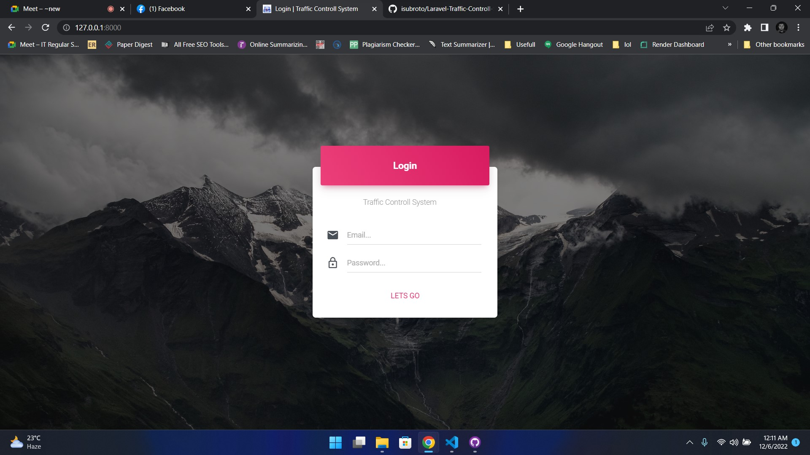

### Dashboard
user can see traffic status and controll traffic signals.
they can open or close the signals to control traffic.
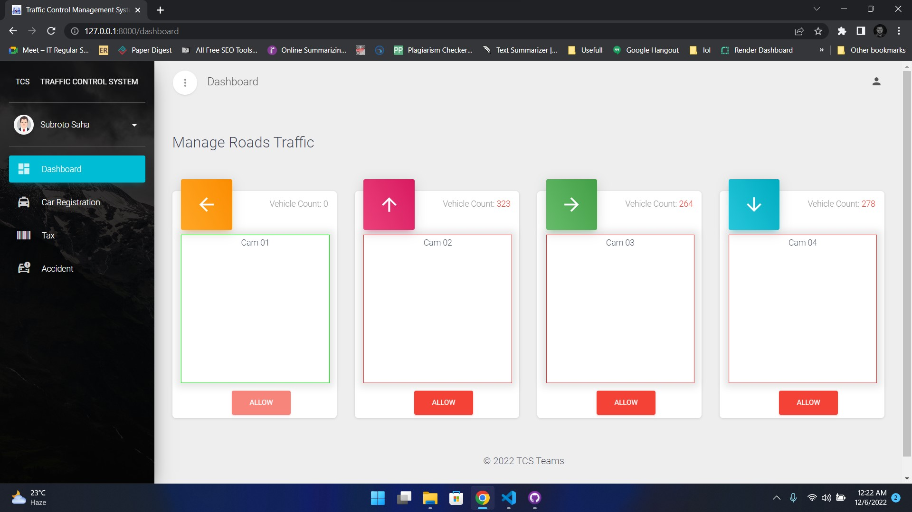
### Car Registration
- user can view registered car details.
  
- user can add a car new for registration by click add car button and input are 
  - Car License Number
  - Car Name
  - Car Model
  - Car Colour
  - Owner Name
  - Owner Number

  
- user can update car details by click edit button. They rederict the car update form.
  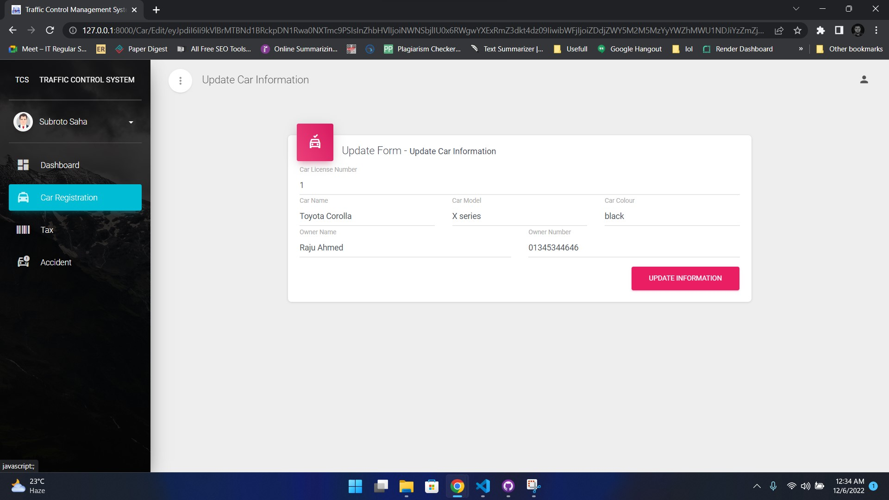
- user can delete car details by click delete car button.
  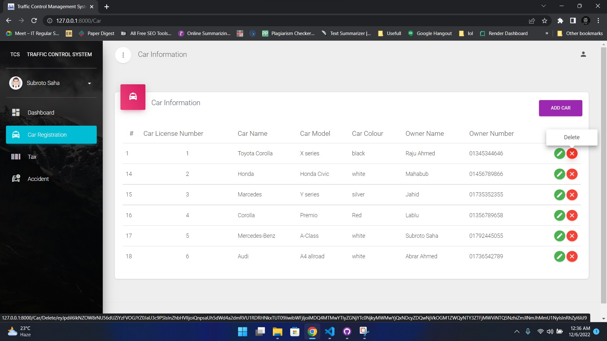

### Tax Collection
- user can show paid tax information
  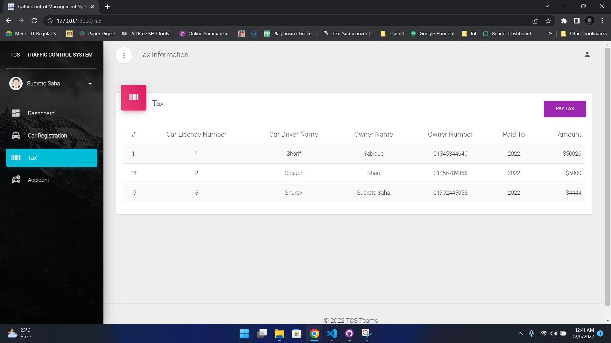
- user can pay tax and the inputs are
  - Choose License Number (that information form registered car)
  - Driver Name
  - Amount
  - Year(By default current year)
  
  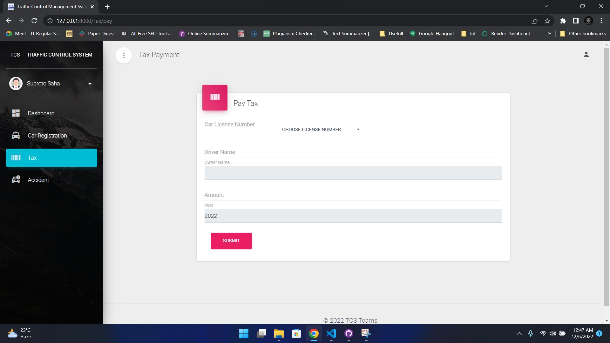

### Accident Record
- user can view accident record of registered cars.
  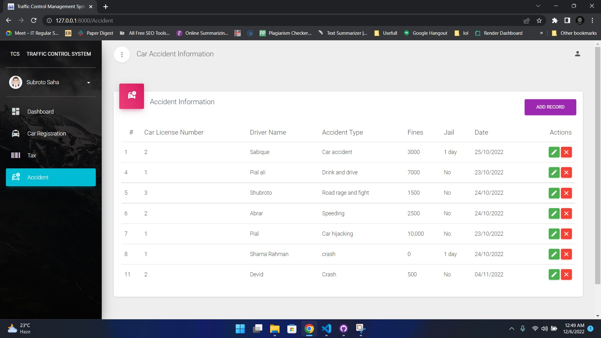
- user can add new accident record for registered car by click add car button and input are 
  - Choose License Number(that information form registered car)
  - Driver Name
  - Fines (if any)
  - Jail (if any)
  - Owner Name
  - date

  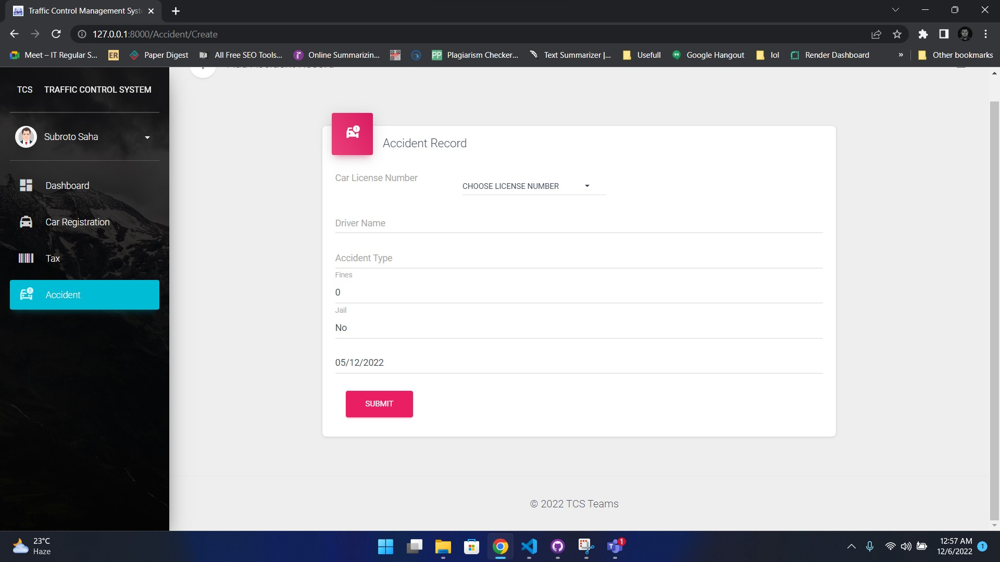
- user can update Accident details by click edit button. They rederict the Accident update form.
  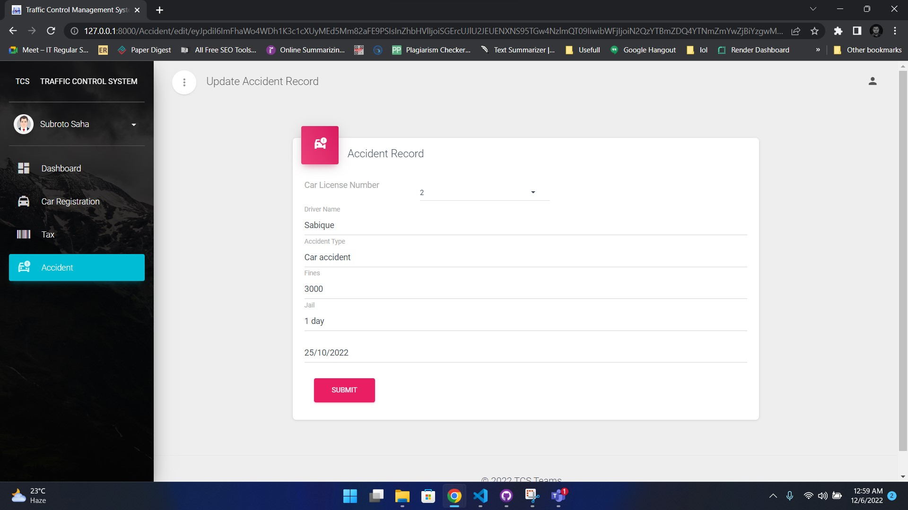
- user can delete Accident details by click delete car button.
  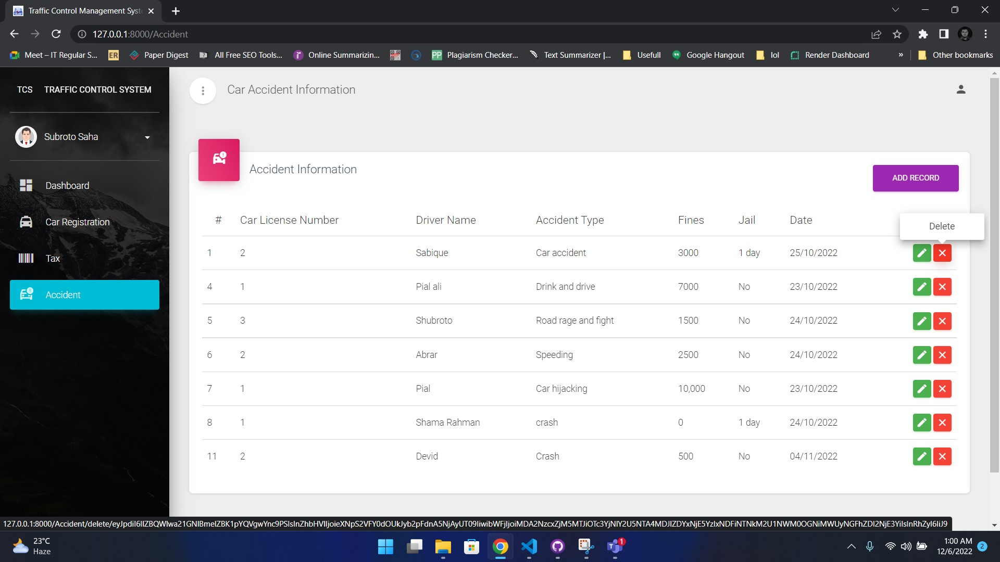
### logout
you can log out form system by clicking logout button.
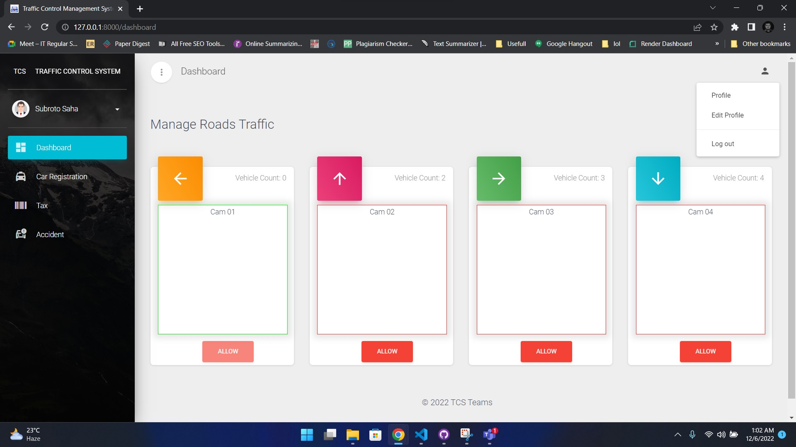

all process(without login and logout) is shown to this system for a valid user. To access the system you need to login first.